

  <h1><b>Hello, I'm Kseniya 🤗</b></h1>
  Frontend Developer

---

### Contacts:

**Lacation:** Minsk, Belarus 
**Phone:** +375 29 105 09 59 
**Email:** sharshnevakseniya@gmail.com 
**Linkedin:** in/kseniya-sharsneva 
**Telegram:** @SharshnevaKseniya 
**My [CV](https://shar-cv.netlify.app/sharshneva-kseniya-cv.pdf)** 

---

### Tech Stack:

Coding:

Styling:

Testing:

Tools & Workflow:

---

## Certificates

<table>
  <tr>
    <td width="auto" align="center">
      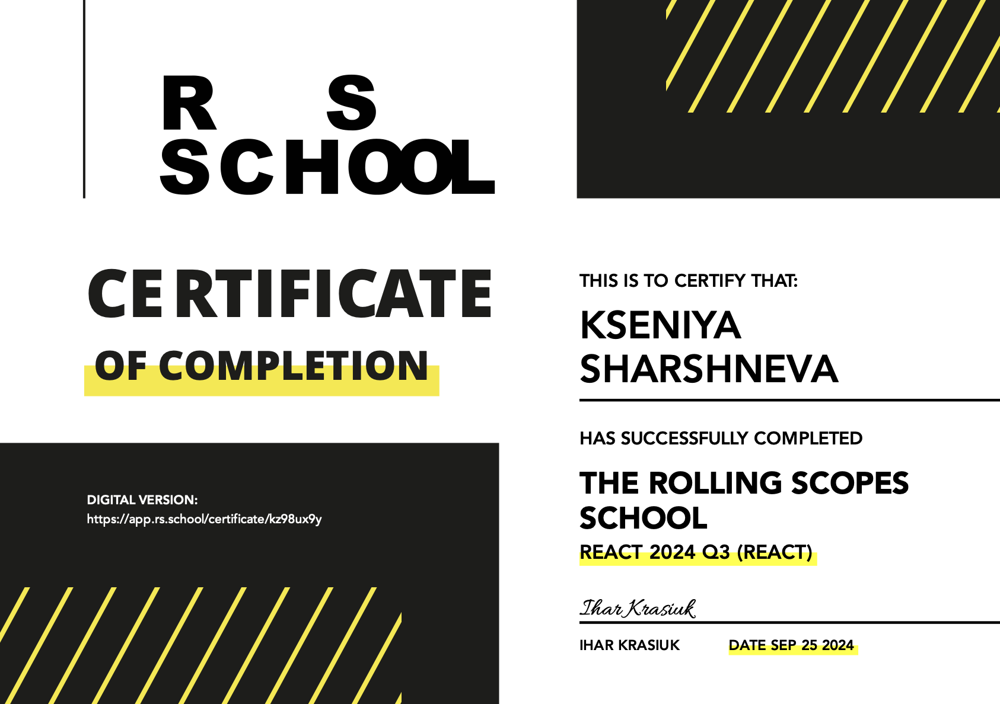
    </td>
    <td width="auto" align="center">
     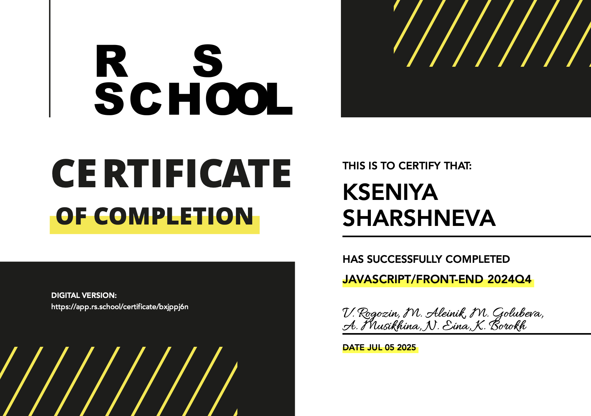
    </td>
    <td width="auto" align="center">
     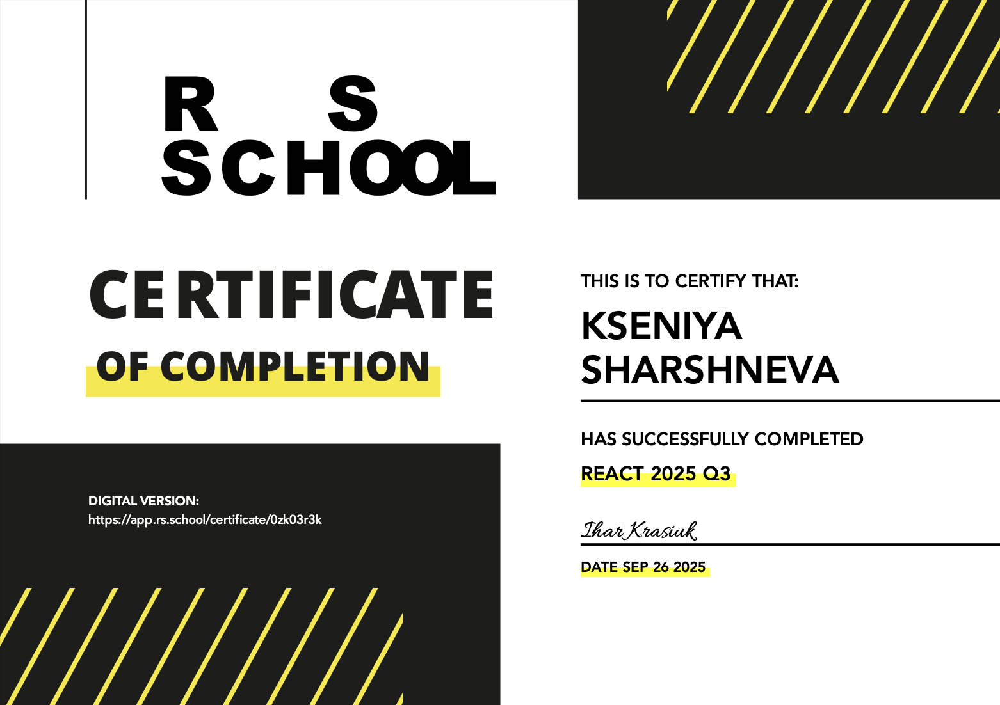
    </td>
  </tr>
</table>

---

## Featured Projects

### **REST Client**

_Developed as a group project together with other developers_

<table>
  <tr>
    <td width="40%" align="center">
      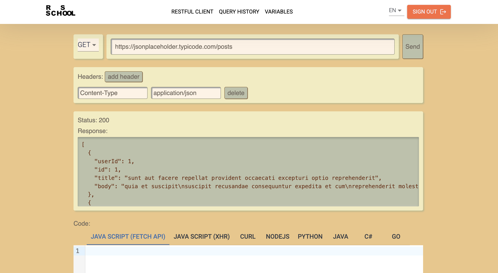
    </td>
    <td width="60%" valign="top">
      <b>Description:</b> 
     REST Client is a simplified version of Postman — a powerful platform for working with and developing APIs. The application supports selecting HTTP methods, specifying URLs, request bodies, and headers. It also includes authentication and authorization to restrict access to registered users, as well as a history section that allows viewing and reusing previously executed requests. 
      <b>Stack:</b> 
      React, Next.js (App Router),TypeScript, HTML, SCSS, Prettier, ESLint, Vitest, Yup, Firebase, MaterialUI, MSW, React Testing Library, Husky, Vercel 
      <a href="https://rest-client-app-updp.vercel.app/en" target="_blank"><b>Demo</b></a> |
      <a href="https://github.com/KsushaSher/REST-Client" target="_blank"><b>Repository</b></a>
    </td>
  </tr>
</table>

### **Performance**

<table>
  <tr>
    <td width="40%" align="center">
      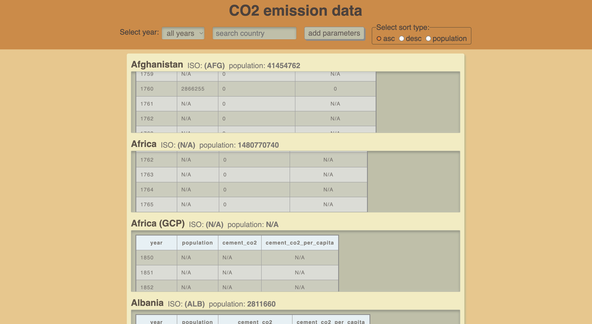
    </td>
    <td width="60%" valign="top">
      <b>Description:</b> 
     The app displays CO₂ emissions data by country from a large hierarchical JSON file. Users can view a list of countries with key indicators, tables with annual data, and add additional columns via a modal window.
     Year selection, regional filtering, country search, and sorting are supported. React.memo, useMemo, and useCallback are used to optimize performance, ensuring a fast and responsive interface. 
      <b>Stack:</b> 
      React, TypeScript, HTML5, SCSS, Redux Toolkit, React Router, React Portal, Vite, Vitest, MSW, React Testing Library, ESLint, Prettier, Husky, Lint-Staged, Netlify 
      <a href="https://react-performance2025-1010.netlify.app/" target="_blank"><b>Demo</b></a> |
      <a href="https://github.com/KsushaSher/ReactQ32025/tree/performance" target="_blank"><b>Repository</b></a>
    </td>
  </tr>
</table>

### **Forms**

<table>
  <tr>
    <td width="40%" align="center">
      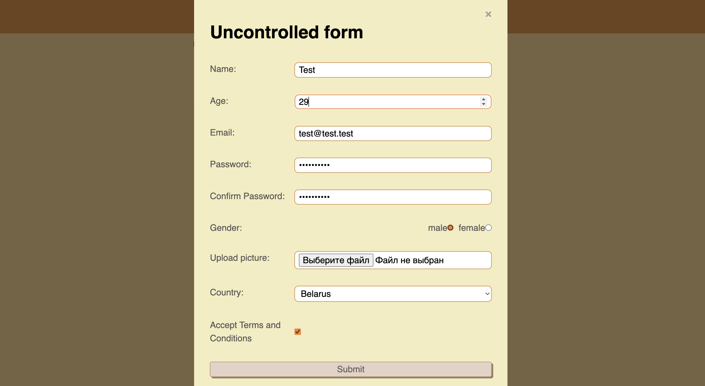
    </td>
    <td width="60%" valign="top">
      <b>Description:</b> 
     The app allows users to fill out two forms—controlled and uncontrolled. Data collection, image upload, and field validation are all implemented. Once submitted, the form data is displayed in the corresponding section as a card. 
      <b>Stack:</b> 
     React, TypeScript, HTML5, SCSS, Redux Toolkit, React Router, React Portal, Vite, Vitest, MSW, React Testing Library, ESLint, Prettier, Husky, Lint-Staged, Netlify 
      <a href="https://react2025-forms10.netlify.app/" target="_blank"><b>Demo</b></a> |
      <a href="https://github.com/KsushaSher/ReactQ32025/tree/forms" target="_blank"><b>Repository</b></a>
    </td>
  </tr>
</table>

### **Сharacter search**

<table>
  <tr>
    <td width="40%" align="center">
      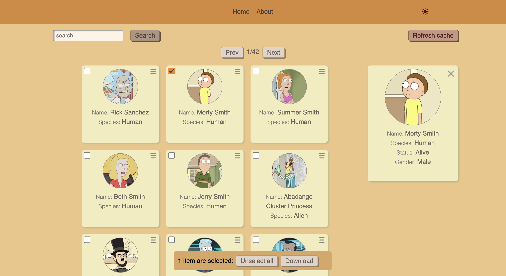
    </td>
    <td width="60%" valign="top">
      <b>Description:</b> 
   This Rick and Morty-style web app loads character cards from an external API and offers interactive name search, pagination, theme changes, and routing, including an "About Me" page. By clicking on a card, users can view detailed information about the character. Multiple characters can be selected and downloaded as a CSV file. The app also includes a button to clear cached API responses. 
      <b>Stack:</b> 
     React, TypeScript, HTML5, SCSS, Redux Toolkit, RTK Query, React Router, Vite, Vitest, MSW, React Testing Library, ESLint, Prettier, Husky, Lint-Staged, Netlify 
      <a href="https://react-class-components1010.netlify.app" target="_blank"><b>Demo</b></a> |
      <a href="https://github.com/KsushaSher/ReactQ32025/tree/api-queries" target="_blank"><b>Repository</b></a>
    </td>
  </tr>
</table>

### **Decision Making Tool**

<table>
  <tr>
    <td width="40%" align="center">
      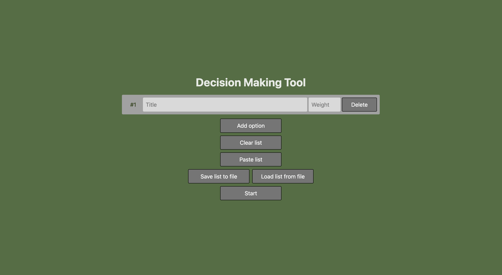
    </td>
    <td width="60%" valign="top">
      <b>Description:</b> 
   The Decision Making Tool is a single-page application (SPA) designed to help streamers and board game players make weighted random decisions.
The app consists of two parts:  
Option List – allows users to create, edit, save, and load option lists, as well as navigate to the decision picker. 
Decision Picker – visualizes the list, randomly selects an option based on weights, displays the result, and lets users return to the list. 
      <b>Stack:</b> 
     TypeScript, HTML, SCSS, Canvas API, File API, Web Storage API, requestAnimationFrame, Hash Router, Prettier, ESLint, StyleLint, Vite 
      <a href="https://decision-making-tool-sher.netlify.app/" target="_blank"><b>Demo</b></a> |
      <a href="https://github.com/KsushaSher/decision-making-tool" target="_blank"><b>Repository</b></a>
    </td>
  </tr>
</table>

### **Nonograms**

<table>
  <tr>
    <td width="40%" align="center">
      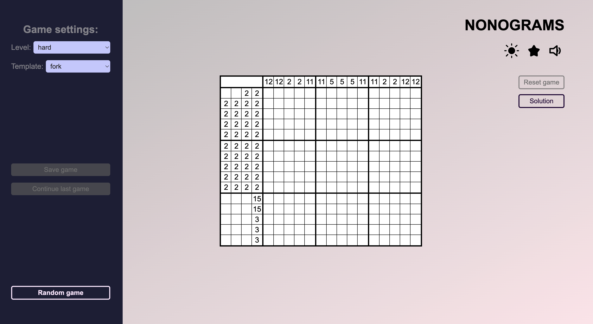
    </td>
    <td width="60%" valign="top">
      <b>Description:</b> 
      Nonograms are Japanese logic puzzles where players uncover hidden images by filling in cells according to numerical clues. 
      The project features multiple layouts and difficulty levels, a leaderboard, solution preview, random puzzle selection, game saving and resuming options, as well as customizable themes and sound settings. 
      <b>Stack:</b> 
      JavaScript, HTML, SCSS, ESLint, Prettier, Webpack 
      <a href="https://nonograms-sher.netlify.app/" target="_blank"><b>Demo</b></a> |
      <a href="https://github.com/KsushaSher/nonograms" target="_blank"><b>Repository</b></a>
    </td>

  </tr>
</table>

### **Christmas shop**

<table>
  <tr>
    <td width="40%" align="center">
      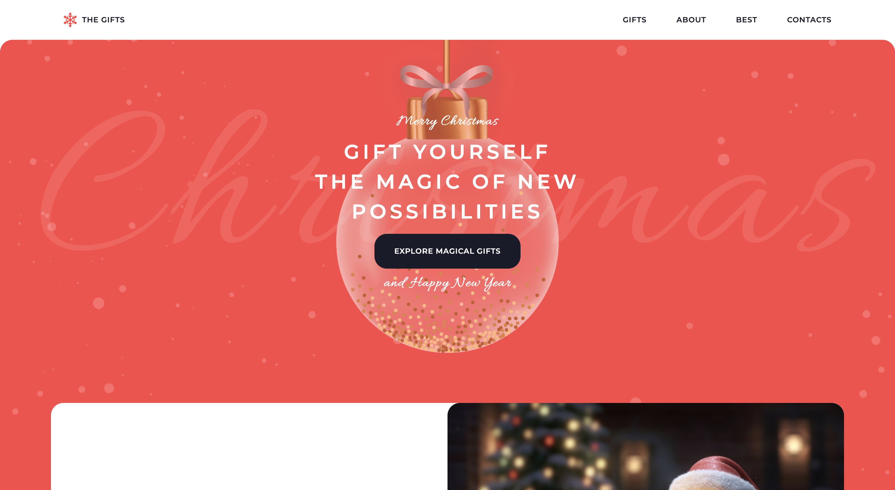
    </td>
    <td width="60%" valign="top">
      <b>Description:</b> 
     Website for a Christmas toy store 
      <b>Stack:</b> 
      JavaScript, HTML5, SCSS, Webpack 
      <a href="https://christmas-shop-sher.netlify.app/" target="_blank"><b>Demo</b></a> |
      <a href="https://github.com/KsushaSher/christmas-shop" target="_blank"><b>Repository</b></a>
    </td>

  </tr>
</table>

### **Coffee house**

<table>
  <tr>
    <td width="40%" align="center">
      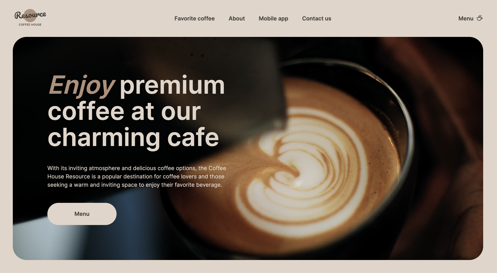
    </td>
    <td width="60%" valign="top">
      <b>Description:</b> 
      Coffee shop website 
      <b>Stack:</b> 
      JavaScript, HTML5, SCSS, Webpack 
      <a href="https://coffee-house-sher.netlify.app/" target="_blank"><b>Demo</b></a> |
      <a href="https://github.com/KsushaSher/coffee-house" target="_blank"><b>Repository</b></a>
    </td>

  </tr>
</table>
